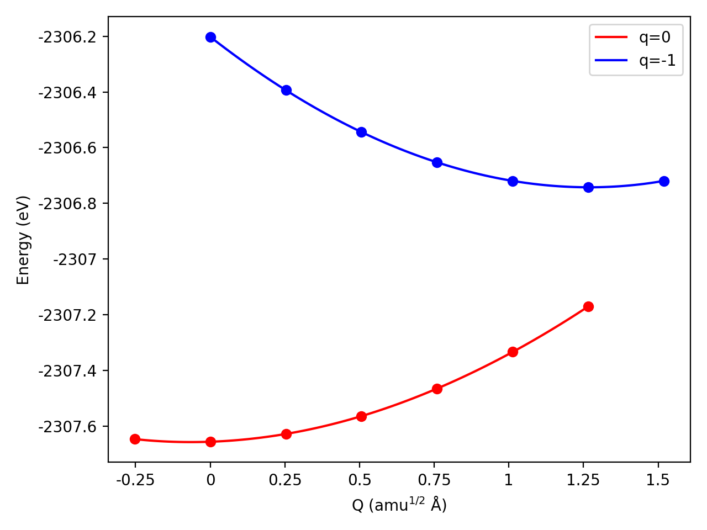
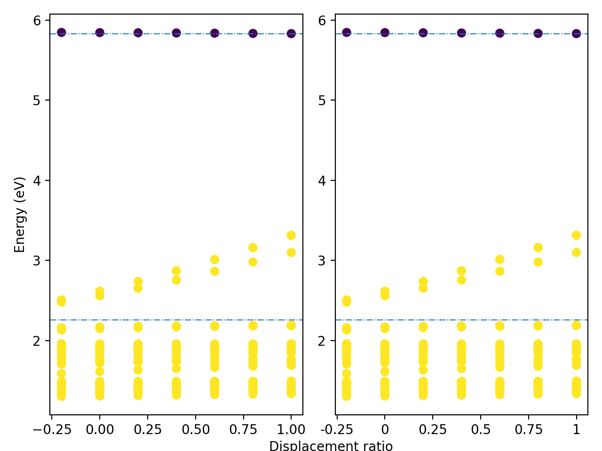
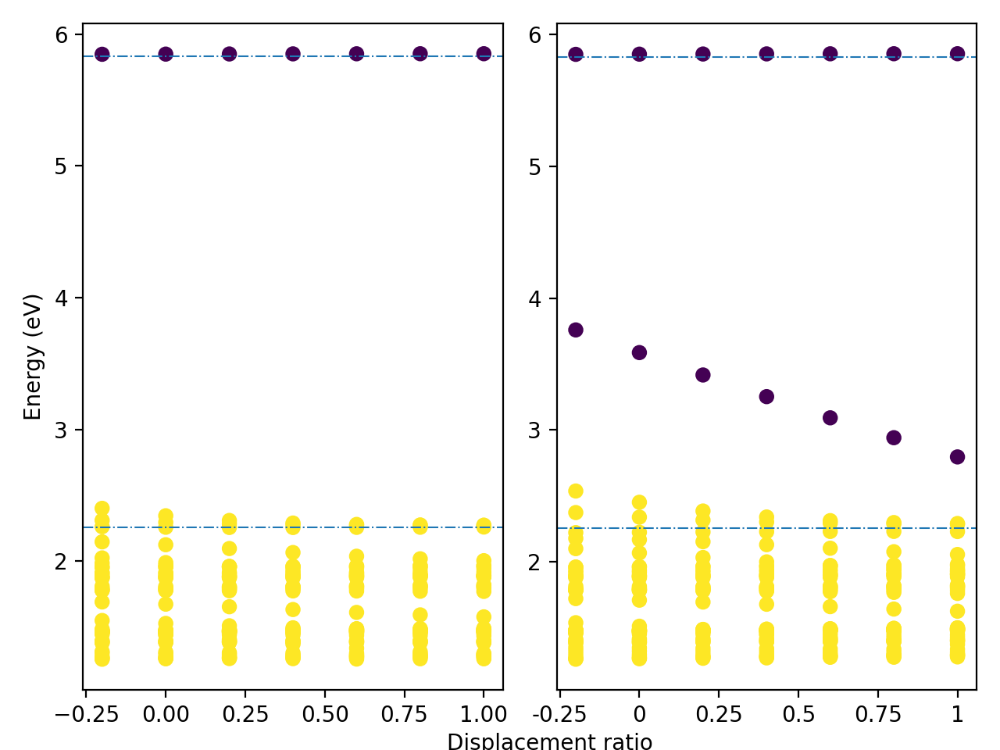

pydefect_ccd
===========

pydefect_ccd is a tool to generate input files to calculate configuration 
coordinate diagrams for point defects in semiconductors and insulators.
The supported package is only VASP so far.

The detailed theory is written in the following paper:


Requirements
------------
- Python 3.12 or higher
- nonrad 
- pymatgen
- [pydefect](https://github.com/kumagai-group/pydefect)
- see requirements.txt for others

[vise](https://github.com/kumagai-group/vise) is also recommended to generate 
VASP input files and analyze VASP output files.

- License
-----------------------
This code is licensed under the MIT License.


Workflow
-----------------------------------------
Here, I show an example using C-on-N defect in GaN.

1. Create a `ccd_init.json` file from two directories containing pydefect files. 
If the excited state has one more (less) charge state, n-type (p-type) is assumed.
```bash
pydefect_ccd make_ccd_init -u ../unitcell.yaml -pbes ../perfect/perfect_band_edge_state.json -fd ../C_N1_-1 -sd ../C_N1_0 -em ../effective_mass.json
```
The defect in `first_dir` needs to show higher formation energy than that in `second_dir`.
For example, in the above command, the formation energy of C_N1_-1

You can always check the json files using the `pydefect_print` command in pydefect.

2. We next construct the directories for CCD calculations.
```bash
pydefect_ccd make_ccd_dirs --ccd_init ccd_init.json 
```

3. After finishing the VASP calculations in each directory, 
run the following commands to generate the pydefect `calc_results.json`, 
`band_edge_orbital_infos.json`, and `band_edge_states.json` files 
in each directory.
```bash
pydefect_vasp cr -d disp*
pydefect_vasp beoi -d disp_* -pbes ../../../perfect/perfect_band_edge_state.json --no_participation_ratio
pydefect bes -d disp_* -pbes ../../../perfect/perfect_band_edge_state.json
````
It is important to add the `--no_participation_ratio` option to avoid errors
because the defect_structure_info.json file is not created in these directories.

4. We can also evaluate the corrections for the CCD calculations.
The details are written in 
[this paper](https://doi.org/10.1103/PhysRevB.107.L220101).
Note that this correction is needed even for neutral defects.
```bash
pydefect_ccd make_ccd_corrections -d disp_* -u ../unitcell/unitcell.yaml -ndcr ../../../C_N1_-1/calc_results.json -ndde ../../../C_N1_-1/defect_entry.json -p potential_curve_spec.json
```

5. We then create `single_point_info.json` in each directory, which
summarize the calculation result for each single point, with the following command.
```bash
pydefect_ccd make_single_point_results -d disp_* 
```

6. Next, we create `potential_curve.json` at each q using the following command.
```bash
pydefect_ccd make_potential_curve_result -d disp_* 
```

7. Finally, we create the `ccd.json` file by merging all the calculated data 
using the following command.
```bash
pydefect_ccd make_ccd --ccd_init ccd_init.json --ground_potential_curve q_0/potential_curve.json --excited_potential_curve q_-1/potential_curve.json
```


8. We can plot the configuration coordinate diagram using the following command.
```bash
pydefect_ccd plot_ccd --ccd ccd.json
```
Now the following figure is obtained.


After checking the configuration coordinate diagram,
we can add more single point calculations, for  example, as follows.
```bash
pydefect_ccd cd --ccd_init ccd_init.json -fsr 1.2 1.4 -sfr -0.4
```
Then, iterate steps 3 to 8 again.

9. We can also plot the eigenvalues along the configuration coordinate using the following command.
```bash
pydefect_ccd plot_eigenvalues --ccd_init ../ccd_init.json -d disp_*
```
Now the following figure is obtained.



10. 
```bash
pydefect_ccd make_wswq_dirs --ccd_init ../ccd_init.json --dirs disp_{-0.2,-0.1,0.0,0.1,0.2}
```
Under the static approximation, we can evaluate the electron-phonon coupling constant
near the equilibrium geometry.

11.
```bash
pydefect_ccd make_e_p_matrix_element 
```

Citing pydefect_ccd
---------------
When pydefect_ccd has been used in your research, 
please cite the following paper.

Yu Kumagai<br>

In addition, please cite the following papers:
- Theory: 
[Alkauskas, Yan, Van de Walle, PRB (2014).](https://doi.org/10.1103/PhysRevB.90.075202)

- Code:
[Turiansky et al., omput. Phys. Commun. (2021).](https://www.sciencedirect.com/science/article/abs/pii/S0010465521001685)

Contact info
--------------
Yu Kumagai<br>
yukumagai@tohoku.ac.jp<br>

Tohoku University (Japan)
